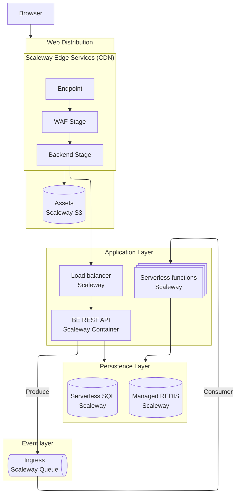

# Scaleway PoC Mono repo

This repo contains a example of a typical cloud architecture built on the cloud provider Scaleway.

The aim is to implement a typical basic application having the following high level domains:

- Web application
- REST API
- Producer/Consumer event handling
- Persistence layer for simpel key/value store.

In all cases the goal

## Architecture

## Overview diagram



## IaC

Infrastructure is managed through OpenTofu using the Scaleway Terraform providers in `./iac/`.

Install OpenTofu and export the env variable `TF_VARS_project_id` to point it at the deployment target or populate the `.tfvars` file.

For example, to deploy to the default project:

```fish
set -gx TF_TF_VAR_project_id (scw account project list --output json |jq .[0].id)
```
### Web distribution

Currently not yet implemented, [Edge Services](https://www.scaleway.com/en/edge-services/) are to be used for this.

These should implement:

- Endpoint stage
- WAF stage
- Backend stage

Caching can be ommitted

Frontend to be served as static bundle from Scaleway Object Store (S3 workalike) in website mode accessed via Edge Services backend stage.

## Backend and triggered functions

Serverside functionality is implemented in Rust.

The main API application is built using [Rocket](http://rocket.rs) and writes to Scaleway SQS as a producer and Scaleway managed REDIS for persistence.

Triggered functions are implemented as a small Rust shared library exposing `handle()` functions.

Components shared (such as serializable models) between the API application and consumer functions are in a local dependency `lib`.

## Frontend

TODO! Curl is a frontend, isn't it?


## Persistence

REDIS Is used for a simple key/value store, it's run as a managed instance.

