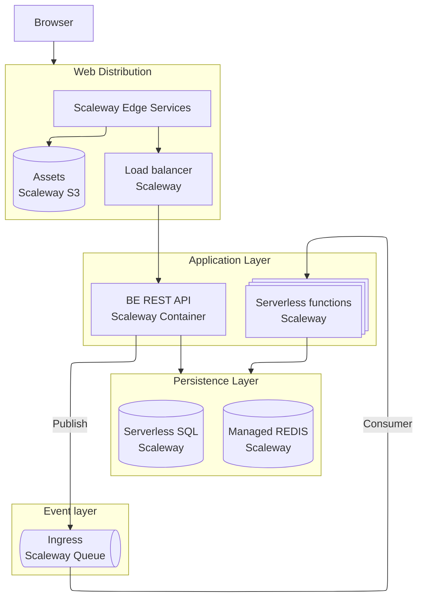

# Scaleway PoC Mono repo

This repo contains a super basic example setup of a typical cloud architecture built on Scaleway.

## Architecture overview

## Components

### Backend

Simple Rocket API.
