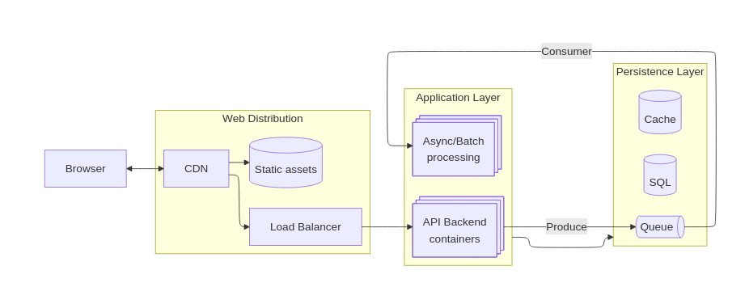
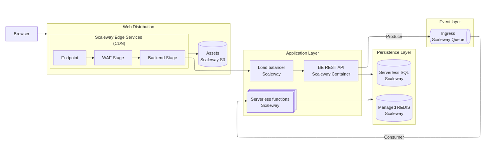

# Scaleway as a EU Cloud provider?

# context: World is crazy

With the current state of....things, should we look at moving your crown jewels?

---

# Big 3 Cloud alternatives

What alternatives do we have to AWS, Azure and GCP?

- Colocated bare-metal
- Managed server hosting
- Cloud providers

Sliding scale of complexity developer and maintenance demands.

---

# Cloud provider options

So say we go for a EU Cloud provider, which are there?

- Hetzner Cloud 
  - Biiiig, 'low level'
- OVHCloud
  - Openstack
- UpCloud
  - Finnish!
- ScaleWay
  - Wide set of managed services 

-> Let's try Scaleway, excellent 'spec sheet engineering'

---

# What does a typical bare bones cloud application look like?

---

# How does this map to a Cloud provider?

| Component          | AWS                      | Scaleway             |
|:------------------:|:------------------------:|:--------------------:|
| Distribution       | CloudFront (and friends) | Edge services        |
| Assets             | S3                       | Object store         |
| Managed containers | Fargate                  | Serverless Container |
| Async compute      | Lambda                   | Serverless Functions |
| Queueing           | SQS / SNS                | SQS (yes!), NATS     |
| Relational data    | Aurora / Managed SQL     | Managed SQL          |
| Key store          | ValKey                   | Managed REDIS        |

Specsheet wise, this looks quite complete, how does it fit together?

---

# Architecture on Scaleway

-> Lets look at IaC first.

---

# IaC

We are big, so we do everything in IaC, lets go for Terraform using OpenTofu.

-> Lets take a look at the IaC code

- Scaleway providers are actually quite nice and tidy.
  - Sane defaults
  - Very little boilerplate
  - Low complexity
  
- Downsides?
  - Eh, going outside of basics requires API calls etc.
  
OpenTofu? Already shows signs of bitrot, their language server lags a year behind for example.

--- 

# Console Experience.

Well you probably want to see the console anyway, it has a nice colour scheme!

-> [Console](https://console.scaleway.com/organization)

- Cool!
  - Cost indicators *everywhere*
  - Reasonably intuitive, easy to oversee
  
- Meh
  - Some parts are decoupled from the main console.
	- Logging is separated out into your own Grafana instance
    - NATS Event broker is separate system.

---	

# Scaleway developer experience

Services are a mix of managed OSS,  AWS clones and Scaleway custom.

The experience per service is thus a bit all over the place.

IAM is primitive and not coherent, nothing at the level of AWS finegrained IAM.

Functions platform is primitive and at least for Rust has severe limitations.

Documentation is extremely sparse, problems can be hard to debug.

---

# But is it all bad?

No, it does everything it says on the tin after understanding the services.

- Setup of producer-consumer pattern was simple and works fine.
- Container/Function scaling is extremely simple and works well.
- Grafana as logging platform is actually great!
- Time to setup is very fast.

---

# Lessons learned

Don't expect every service to really work as you thought coming over.

Some components leads you to think they are direct equivalents but then steer you to their own instead.

- Queues
  - SQS works, but has severe limitations.
  - Scaleway's real solution is using NATS.
- Serverless containers
  - Work, but coldstarts are extremely severe
  - Intended for background processes working off NATS triggers
  - They really want you to use managed K8.
   

---

# Horror parts?

Many services require AWS Client libraries to connect to (ala Openstack), subtle bugs took me nights to figure out.

---

# Can you work with these limitations?

But the final question, is this enough to build customer projects?
